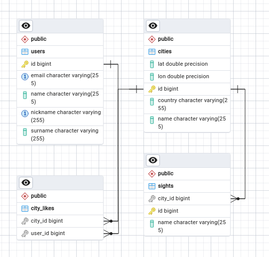

# DISTANCE BETWEEN CITIES
## Описание:
**Проект находится в разработке**  
Приложение, считающее расстояние между двумя городами. Также есть следующие сущности: 
- Пользователи
- Города
- Достопремичательноcти

Пользователи могут лайкать города, которые могут содержать достопремичательности. Для каждой сущности реализованны
все методы CRUD.

## Для запуска проекта необходимы:
- Java 21
- Spring Boot v3.2.2
- Система сборки maven
- Api ключ на сайте https://home.openweathermap.org
- база данных postgreSQL
## Ссылка на Sonar
https://sonarcloud.io/summary/overall?id=ArtemShaputko_citydistance